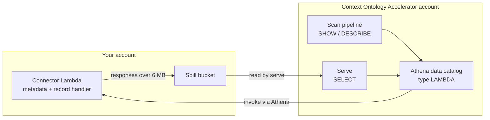

# Custom Connector Sources

How to onboard a data source Context Ontology Accelerator has no native support for — SAP, a
mainframe, an internal REST API, a proprietary SaaS product — by wrapping it in
an **AWS Athena Query Federation SDK connector**: a Lambda function you author
and deploy in *your own* AWS account.

Context Ontology Accelerator then:

1. **Registers** your connector Lambda as a `LAMBDA`-type Athena **data catalog in its own
   account**, at source-create time, under a name it derives from the source id.
2. **Discovers** that catalog's metadata with Athena SQL — `SHOW DATABASES`,
   `SHOW TABLES`, and one `DESCRIBE` per table.
3. **Serves** single-source queries against the catalog through Athena.

Your connector stays yours: Context Ontology Accelerator runs no code in your account, and needs
no per-source code of its own to support the source.

> `{prefix}` is the deployment prefix `{project}-{env}` (e.g. `accelerator-dev`).
> `<accelerator-account>` is the account where Context Ontology Accelerator is deployed;
> `<connector-account>` is the account holding your connector Lambda.



## What each side owns

| Concern | Owner |
|---|---|
| Connector Lambda — code, memory, timeout, concurrency, cost | You |
| Spill bucket — creation, encryption, lifecycle, cost | You |
| Resource policies on the Lambda, spill bucket, and spill KMS key | You |
| Athena data catalog registration and teardown | Context Ontology Accelerator |
| Metadata discovery, enrichment, review, and query execution | Context Ontology Accelerator |

Catalog registration only records the catalog name → Lambda ARN mapping; it does
not invoke your function. Source creation therefore succeeds before your invoke
grant exists, and a missing grant surfaces at the first scan instead. Deleting
the source (or its namespace) deletes the catalog.

## Before you start

- [ ] Connector Lambda deployed in `<connector-account>`, **in this deployment's region**
- [ ] Connector Lambda **tagged `coa:connector = true`** (required — see below)
- [ ] `spill_prefix` on the connector set to **`connectors/<connectorId>/spills`**
- [ ] Spill bucket encrypted with **SSE-KMS** using a customer-managed key **tagged `coa:connector-spill = true`**
- [ ] Column comments emitted as **Arrow schema metadata keyed by column name**, with `@pk`/`@fk` tags where you have declared keys
- [ ] Three resource policies written (connector Lambda, spill bucket, spill KMS key)
- [ ] The name of the one database inside your catalog this source will expose

## What your connector must return for a usable ontology

Column comments are the whole ontology-quality story for this source type.
Athena's table-metadata API returns column **names and types only** — it
populates comments solely for `GLUE`-type catalogs, where it reads Glue's own
comment column. Context Ontology Accelerator therefore recovers comments by running
`DESCRIBE <catalog>.<database>.<table>` through Athena, which does return them
for a Lambda-backed catalog.

| Your connector emits | Discovered metadata | What AI enrichment then does |
|---|---|---|
| Column comments carrying `@pk`/`@fk` tags | Deterministic column descriptions **and** declared primary/foreign keys | Nothing for those fields — AI-generated metadata never overwrites deterministic metadata |
| Column comments, no tags | Deterministic column descriptions; no declared keys | Infers relationships from column naming |
| Names and types only | Names and types | Generates every description; infers primary keys from naming and relationships from column overlap |

Two limits apply no matter how cooperative the connector is:

- **Nullability is never captured.** Neither Athena's `Column` type nor
  `DESCRIBE` carries it. This has no ontology impact — nullability is not mapped
  into the induced model.
- **Table-level descriptions are always AI-generated.** Only the bare `DESCRIBE`
  form works against a federated catalog (`EXTENDED` and `FORMATTED` are
  rejected), and the bare form returns column rows only.

!!! warning "Comments must be Arrow schema metadata keyed by column name"
    Athena reads comments from the Arrow **schema's** own metadata map, keyed by
    column name — `SchemaBuilder.addMetadata(columnName, comment)`, one entry per
    column, which is exactly what the SDK's own `GlueMetadataHandler` does with a
    Glue column comment. A comment attached to an Arrow `Field` is serialised,
    reaches Athena intact, and is then ignored. A connector whose comments are on
    the fields looks identical to a connector that emits no comments at all:
    `DESCRIBE` returns name and type with no comment column, every description is
    AI-generated, and every `@pk`/`@fk` tag is lost with the comment that carried
    it. The toolkit's `TableSchema` builds every field with an empty metadata map,
    so the working placement is the only one it can express.

### Declaring primary and foreign keys in column comments

The Athena federation protocol has **no field for key constraints anywhere**, so
a connector cannot report declared keys the way a JDBC source does from
`information_schema`. Declared keys therefore travel **inside the column
comments** as tags, which discovery parses out, strips, and turns into the same
primary-key and foreign-key records the JDBC path produces.

!!! note "This section is for connector authors"
    Everything below is what *your encoder* must produce. If you are onboarding a
    Databricks SQL Warehouse, `connectors/databricks/` already does it: it reads
    Unity Catalog's `information_schema` and emits these tags for you, so there
    is nothing here for you to write. It also **strips** any `@pk`/`@fk` tag it
    finds in a Unity Catalog column comment — a comment is editable by anyone
    holding `MODIFY`, and an honoured hand-written tag could assert a key the
    warehouse never declared.

```text
comment   := (human_text | tag)*
tag       := "@pk" | "@fk" "(" reference ")"
reference := segment ("." segment)*        ; the last two are TABLE.COLUMN
segment   := pad (quoted | unquoted) pad   ; entirely one or the other
quoted    := '"' (not_a_quote | '""')* '"' ; may contain "." and ")"
unquoted  := [A-Za-z0-9_$-]+               ; no ".", no ")", no whitespace
pad       := whitespace*
```

The rules your encoder must follow:

- **`@pk` takes no operand.** Every column whose comment carries `@pk` is a
  member of the table's primary key; a composite primary key is the set of those
  columns, ordered as `DESCRIBE` returns them. `@pk(id)` and `@pk=id` are
  near misses, not tags.
- **`@fk(parent_table.parent_column)` goes on the child column.** The child
  column is never named in the tag — it is the column whose comment carries it —
  so the child name never needs quoting.
- **A composite foreign key is one `@fk(...)` per participating child column.**
  There is no grouped syntax: keys are stored one row per column pair, exactly
  as the JDBC path already flattens composite foreign keys.
- **The operand is bracketed**, and ends at the first `)` outside a quoted
  segment. Prose may follow the closing bracket immediately, and a sentence
  period after it is prose. Whitespace inside the brackets is padding:
  `@fk( orders . order_id )` is the same tag as `@fk(orders.order_id)`.
- **Quoting is per segment, optional, and independent**, as SQL allows. Quote
  only the segments that need it: `@fk("my orders"."customer id")`,
  `@fk("t".col)`, `@fk(t."c")` are all legal. A literal double quote inside a
  quoted segment is doubled (`""`), so `@fk("say ""hi"" now".x)` targets the
  table `say "hi" now`. A quoted name may contain `)`:
  `@fk("total (usd)".amount)`. A segment must be *entirely* quoted or entirely
  bare — `@fk("a"b.c)` is an error, not the table `ab`.
- **Extra leading qualification is tolerated.** The last two segments are
  `TABLE.COLUMN`; anything before them is catalog/database/schema and is
  dropped, so `@fk(db.public.orders.order_id)` and `@fk(orders.order_id)`
  resolve alike.
- **Recognition is case-sensitive, and references are matched exactly.** Spell
  the target as `DESCRIBE` reports it (lower case, for Athena). Quoting affects
  only how the name is written, never what is stored:
  `@fk("orders"."Order Date")` stores the column as `Order Date`. A case or
  spelling mismatch does not error — it reads as a target outside the scan.
- **A tag must not follow an identifier character**, so `owner bob@pk.example.com`
  is prose rather than a primary-key declaration.
- **Understood tags are stripped from the stored description.** A tag the parser
  cannot act on is left in the description **verbatim**.

!!! warning "A leftover tag in a description is the only feedback you get"
    Parse warnings land in this deployment's logs, not in your account. So the
    signal that a tag is wrong is the tag itself surviving into the stored
    column description: `@fk(orders)` (no column), `@fk(orders.)` (empty
    column), `@fk(orders.order id)` (space in a bare segment),
    `@fk(orders.order_id, nullable)` (prose left inside the brackets),
    `@fk=orders.order_id` (retired spelling — use the bracketed operand), and
    `@PK` (wrong case) all read as text and record no key. Review a scanned
    source's column descriptions for stray `@pk`/`@fk` text before approving it.

Worked example — the comment your connector emits, and what is stored:

| Comment emitted | Stored description | Key recorded |
|---|---|---|
| `Customer identifier @pk` | `Customer identifier` | primary-key member |
| `Parent order @fk(orders.order_id)` | `Parent order` | FK → `orders.order_id` |
| `Country of the sales region @fk(regions.country)` | `Country of the sales region` | FK → `regions.country` |
| `Zone within the country @fk(regions.zone)` | `Zone within the country` | FK → `regions.zone` — with the row above, the composite FK to `regions(country, zone)` |
| `Human label @fk("regions"."zone label")` | `Human label` | FK → `regions`, column `zone label` |
| `Parent order @fk(orders)` | `Parent order @fk(orders)` | none — malformed, left verbatim |

Do not write prose *inside* the brackets. One ambiguity survives the grammar: a
dotted bare word inside the operand reads as qualification, so
`@fk(orders.order_id.see)` resolves to the column `order_id.see`, which is
character-for-character the shape of a legitimate three-segment reference.

## The connector Lambda must be in this deployment's region

Athena can invoke a connector cross-region when given a full ARN. Context Ontology Accelerator
does **not** support it: the IAM grant that lets Athena invoke your function is
region-pinned, so a cross-region connector would fail at query time. Source
creation rejects a `connectorFunctionArn` whose region differs from the
deployment's with a `400`.

Pass the **full** ARN,
`arn:aws:lambda:<region>:<connector-account>:function:<name>`, optionally
qualified with a version or alias. Lambda's partial-ARN
(`<account-id>:function:<name>`) and name-only forms are rejected, because an
unqualified name would resolve against the Context Ontology Accelerator account instead of yours.

## One source per database

A source is scoped to exactly **one** database inside your catalog —
`databaseName` is required — because serve pins the query's database context to
the single database the scan discovered. A connector serving several databases
is onboarded once **per database**, each as its own source with its own derived
catalog registration.

## Deploying the connector into this deployment's own account

The usual topology is the one this guide assumes: your connector lives in a
separate account, and you grant access with the resource policies below. Putting
the connector in the **same** account as the accelerator also works, and it needs
no resource policies at all — a same-account call is authorized by the identity
policy alone.

Neither of the two constraints an earlier release documented here still applies:

- **Your function may be named anything**, this deployment's resource prefix
  included. The accelerator's roles do hold an explicit `Deny` on
  `lambda:InvokeFunction` for in-account functions invoked through Athena — it
  stops an Athena user-defined function from reaching the accelerator's own
  Lambdas — but it is scoped by the **absence of the `coa:connector` tag**, not by
  a name pattern. A correctly tagged connector is exempt from it wherever it lives
  and whatever it is called.
- **Spilled responses work.** The spill-read permission is bounded by the
  `connectors/<connectorId>/spills/` key prefix rather than by an account
  exclusion, so a spill bucket in the accelerator's own account is read on the
  same terms as one in yours. It still needs SSE-KMS with a key tagged
  `coa:connector-spill = true`, exactly as below.

What is still true, and the reason to prefer a separate account anyway: a
cross-account invoke must be allowed by the resource policy **as well as** the
identity policy, so you get a second, independent barrier that a same-account
deployment does not have.

## Resource policies you must grant

Cross-account access needs a grant on the **resource** as well as on the
identity. Context Ontology Accelerator holds the identity-side permissions already; the following
three policies are yours to write, in `<connector-account>`.

| # | Resource | Principal to name | Action | When |
|---|---|---|---|---|
| 1 | Connector Lambda | **Discovery** role **and** **serve** role | `lambda:InvokeFunction` | Always |
| 2 | Spill bucket | **Discovery** role **and** **serve** role | `s3:GetObject` | Whenever the connector has a spill bucket |
| 3 | Spill bucket's KMS key | **Discovery** role **and** **serve** role | `kms:Decrypt` | Whenever the connector has a spill bucket — SSE-KMS is required |

Name both roles on all three. One Lambda serves both paths, and the grant is
written per querying principal rather than per path. The role that exercises the
spill grant in practice is **serve** — discovery's `SHOW`/`DESCRIBE` traffic is
metadata-handler traffic, and metadata responses do not spill — but discovery is
granted for uniformity, and because nothing in the protocol guarantees a metadata
response can never spill.

### Resolve the two principal ARNs

Both are stable per deployment and published in SSM. Run these in
`<accelerator-account>`:

```bash
# Discovery — the scan pipeline's connector Lambda execution role
aws ssm get-parameter --name "/{prefix}/sources/db-connector-role-arn" \
  --query 'Parameter.Value' --output text

# Serve — the runtime role that executes queries through Athena
aws ssm get-parameter --name "/{prefix}/serve/runtime-role-arn" \
  --query 'Parameter.Value' --output text
```

### 1. Connector Lambda resource policy

```bash
# In <connector-account>, once per principal
aws lambda add-permission \
  --function-name <your-connector-function> \
  --statement-id coa-discovery-invoke \
  --action lambda:InvokeFunction \
  --principal <discovery-role-arn-from-ssm-above>

aws lambda add-permission \
  --function-name <your-connector-function> \
  --statement-id coa-serve-invoke \
  --action lambda:InvokeFunction \
  --principal <serve-role-arn-from-ssm-above>
```

Add both statements: discovery invokes the metadata path and serve invokes both,
and one Lambda serves both, so both principals need it.

### 2. Spill bucket policy

When a connector's per-split response exceeds Athena's 6 MB limit, the SDK
writes the batch to the bucket named by the connector's `spill_bucket` and
returns a spill location; Athena, running as the querying role, reads it to
assemble results. That read is a cross-account S3 read, so the bucket policy
must name both querying roles:

```json
{
  "Version": "2012-10-17",
  "Statement": [{
    "Sid": "CoaAthenaFederationSpillRead",
    "Effect": "Allow",
    "Principal": {
      "AWS": [
        "<discovery-role-arn-from-ssm-above>",
        "<serve-role-arn-from-ssm-above>"
      ]
    },
    "Action": "s3:GetObject",
    "Resource": "arn:aws:s3:::<spill-bucket>/connectors/<connectorId>/spills/*"
  }]
}
```

!!! important "`spill_prefix` must be `connectors/<connectorId>/spills`"
    Context Ontology Accelerator's spill-read permission matches **only** object keys
    under `connectors/*/spills/`. Pick any `connectorId` you like — `mock`,
    `sap-hana`, a UUID — the path shape is what matters, not the value.

    Neither AWS default works: non-JDBC connectors default `spill_prefix` to
    `athena-federation-spill`, and JDBC-family connectors make it **required with no
    default**. So this must be set explicitly, and nothing complains if it is not.
    Everything then works until the first query whose per-split response exceeds
    6 MB, which fails with `AccessDenied`.

    The key prefix is what allows your bucket to live in **any** account, including
    the one Context Ontology Accelerator itself runs in — the permission is bounded
    by the path rather than by the account.

!!! important "Your connector Lambda must be tagged `coa:connector = true`"
    The invoke permission cannot be pinned to an account, because your connector
    lives in yours. It is scoped by a resource **tag** instead, so an untagged
    connector is **not invocable** — the first scan fails with an invoke denial, and
    the error names this requirement.

    A tag rather than a naming rule because it cannot be matched by accident: a
    function that merely happens to be named a certain way does not inherit access.

!!! important "The spill bucket must use SSE-KMS with a tagged key"
    Not optional. Context Ontology Accelerator's permission to decrypt spilled data
    requires the key to carry `coa:connector-spill = true`, which makes spill
    authorization an explicit per-key allowlist rather than a path convention.

    Use a **customer-managed** key (the AWS-managed `aws/s3` key cannot be tagged for
    this purpose, and its policy cannot be edited). You need three things on it: the
    tag, a key policy granting both querying roles `kms:Decrypt` with
    `kms:ViaService = s3.<region>.amazonaws.com`, and `kms:GenerateDataKey` for your
    own connector's execution role so it can write.

    Note this is separate from the connector's own `kms_key_id` setting. The
    federation SDK encrypts spilled *content* with an ephemeral key it hands to Athena
    in the response, so that path never calls KMS. What matters here is the bucket's
    server-side encryption.

A connector may also be deployed with **no** spill bucket. That is a supported
shape, but a response that needs to spill then has nowhere to go and the query
fails. Choose it only when your per-split responses are bounded by construction.

!!! note "Why an outer `LIMIT` does not keep you out of spill territory"
    Context Ontology Accelerator injects an outer row limit on every query, but that limit reaches
    your connector only if the connector advertises limit pushdown
    (`SUPPORTS_LIMIT_PUSHDOWN`), which the SDK does not do by default. Without
    it Athena requests the full table and applies the limit itself, so even a
    modest query can spill. Implementing limit and predicate pushdown, and
    keeping splits small, is the way to control spill volume, latency, and cost.

### 3. KMS key policy — required for any spill bucket

The spill bucket must be encrypted with a customer-managed KMS key, so this grant is
required whenever the connector spills at all. The immediate KMS caller on that path
is S3, not Athena, so scope the grant with `kms:ViaService`:

```json
{
  "Sid": "CoaAthenaFederationSpillDecrypt",
  "Effect": "Allow",
  "Principal": {
    "AWS": [
      "<discovery-role-arn-from-ssm-above>",
      "<serve-role-arn-from-ssm-above>"
    ]
  },
  "Action": "kms:Decrypt",
  "Resource": "*",
  "Condition": {
    "StringEquals": { "kms:ViaService": "s3.<region>.amazonaws.com" }
  }
}
```

!!! warning "Setting the connector's `kms_key_id` needs no grant to Context Ontology Accelerator — it needs one to your own Lambda"
    The SDK's own spill encryption is a different mechanism from bucket
    encryption. When you set `kms_key_id` on the connector, the SDK generates a
    data key and ships the **plaintext** key to Athena on the split, so the
    reader never calls KMS — there is nothing for Context Ontology Accelerator's serve role to be
    granted. What that configuration does require is a grant on **your** side:
    the connector Lambda's own execution role needs `kms:GenerateDataKey` and
    `kms:GenerateRandom` on the key. Leaving `kms_key_id` unset is also fine —
    the SDK then encrypts spill with a randomly generated key and no KMS is
    involved. Key off **SSE-KMS on the bucket**, not off `kms_key_id`, when
    deciding whether to write policy 3.

## Register the source

Create via `POST /namespaces/{namespaceId}/sources` with `sourceType: "DATABASE"`
and a `databaseSource.customConnectorConfiguration` body — see **CreateSource** in the
[API Reference](#/api-reference) for the full request schema and response.

```json
{
  "sourceType": "DATABASE",
  "databaseSource": {
    "name": "acme-sap",
    "customConnectorConfiguration": {
      "connectorFunctionArn": "arn:aws:lambda:<region>:<connector-account>:function:<name>",
      "databaseName": "sales",
      "tableFilter": "^dim_|^fact_"
    }
  }
}
```

### Custom Connector Configuration Fields

| Field | Required | Description |
|-------|----------|-------------|
| `connectorFunctionArn` | **Yes** | Full ARN of the connector Lambda. One Lambda serves both metadata and record requests (Athena calls this a composite handler). Its region must equal this deployment's region |
| `databaseName` | **Yes** | The single database inside the connector's catalog this source exposes (1–256 chars) |
| `tableFilter` | No | Regex — only tables matching this are discovered |
| `tableExcludeFilter` | No | Regex — tables matching this are excluded (after the include filter) |

`metadataEnrichmentEnabled` (`true` by default, `false` to skip AI enrichment)
sits on `databaseSource` alongside `customConnectorConfiguration`, not inside it — the
same as for JDBC and Glue sources.

There is no catalog-name field, no region field, and no cross-account role:

- **Catalog name** — Context Ontology Accelerator derives a per-source-unique name and registers the
  catalog under it in its own account. Athena data-catalog names are global per
  account and region, so a caller-chosen name would let two sources collide. The
  registered name is read-only and returned on the source detail as
  `databaseDetails.athenaDataCatalogName` (see **GetSource** in the
  [API Reference](#/api-reference)); use it as the query prefix.
- **Region** — always this deployment's region, since the connector must be
  co-located with it.
- **Cross-account role** — there is nothing to assume. Access is granted on your
  connector Lambda's resource policy, not by Context Ontology Accelerator assuming a role in
  `<connector-account>`.

The scan lifecycle, review workflow, steward edits, and deletion behave exactly
as they do for other database sources — see
[Structured Data Source Guide](sources.md).

## Querying

A Lambda-backed catalog is addressed with **three** parts —
`catalog.database.table` — rather than the four-part form a federated JDBC
source uses:

```sql
SELECT *
FROM "coa-dev-ds_a1b2c3d4"."sales"."orders"
LIMIT 100;
```

Substitute the source's own `athenaDataCatalogName` for the catalog. Queries run
through the namespace's Athena workgroup, and Athena invokes your connector to
satisfy them.

## Lake Formation does not apply to this source type

A Lambda-backed Athena catalog is **not** a Glue Data Catalog object, so there is
no Lake Formation resource to grant on and no Lake Formation permission is
consulted when the source is queried. If your organization centralizes column-
and row-level policy in Lake Formation, that policy does **not** reach a source
onboarded this way.

What does still apply, on every query route:

- Context Ontology Accelerator's **SQL firewall** — `SELECT`-only, table allow/deny, column
  denylist;
- **Cedar authorization** — namespace and role checks on every request.

!!! important "Governance disclosure"
    This is a deliberate property of the mechanism, not a configuration gap.
    A source whose governance must be enforced by Lake Formation has to reach
    Context Ontology Accelerator as a Glue Data Catalog database instead — see
    [Structured Data Source Guide](sources.md#registering-a-glue-data-catalog-source)
    and [Cross-Account Data Sources](cross-account-sources.md).

## Building the connector

**Start from `connectors/README.md` in your COA checkout**, not from this page. That
guide is not published here: it holds the reference connector to copy
(`connectors/example/`), the Java toolkit that does the comment placement and tag
encoding for you, the CDK construct that emits the tag, spill prefix, key and
resource policies this document specifies, and a longer list of non-obvious SDK
constraints. This page is the *contract* — what COA requires of any connector,
however you build it.

The SDK is Java. These are the build and runtime requirements that are otherwise
discovered the hard way:

| Requirement | Why | What you see if you miss it |
|---|---|---|
| Depend on the SDK's **`with-arrow`** artifact classifier | Arrow is **not** a transitive dependency of the SDK | The connector cannot load Arrow classes at runtime |
| Deploy the JAR **via S3** | The `with-arrow` build produces a fat JAR too large for direct Lambda upload | The upload is rejected for size |
| Add `--add-opens=java.base/java.nio=ALL-UNNAMED` to the Lambda's Java options on **JDK 17 and later** | Strong encapsulation denies Arrow's memory module reflective access to `java.nio` | **Metadata calls succeed and every read fails** — it presents as "discovery works, queries are broken" rather than as a build problem |
| Emit **timezone-aware** timestamps | The protocol rejects naive timestamps | The connector is rejected with an unsupported Arrow type error |
| Write **only** the columns present in the request | Athena projects the schema before calling the record handler | A null-vector error — and because unprojected queries pass, it surfaces late |
| Attach comments as **Arrow schema metadata keyed by column name** | Athena reads the schema's own metadata map; a comment attached to an Arrow `Field` is delivered intact and then ignored | Comments never reach the ontology; `@pk`/`@fk` tags are lost with them |

Two more worth knowing: response field order is positional for the list-tables
response (the wrong order is rejected with a field-mismatch error), and the Arrow
schema travels as a bare base64 string of Arrow IPC bytes rather than as JSON.

## Troubleshooting

| Symptom | Cause | Fix |
|---------|-------|-----|
| `400` on create naming `connectorFunctionArn` | The ARN's region differs from this deployment's, or it is a partial/name-only ARN | Deploy the connector in this deployment's region; pass the full `arn:aws:lambda:<region>:<account>:function:<name>` form |
| `SCAN_FAILED` at discovery with no tables found | The connector Lambda's resource policy does not grant the **discovery** role `lambda:InvokeFunction`, or the function is missing the `coa:connector` tag | Add the grant; tag the function, then re-scan |
| Discovery succeeds; every query fails | Missing `--add-opens` on JDK 17+, or the record handler writes columns the request did not project | Fix and redeploy the connector — no re-scan needed, the query path reads no stored metadata |
| Queries succeed until one fails `AccessDenied` | The spilled read is not authorized: `spill_prefix` is not `connectors/<connectorId>/spills`; the bucket is not SSE-KMS; its key lacks the `coa:connector-spill` tag; or the bucket/key policy does not name the querying roles | Set `spill_prefix`; encrypt the bucket with a tagged customer-managed key; add the bucket and key policies |
| Column descriptions are all AI-generated although your connector emits comments | Comments were attached to the Arrow fields instead of the schema's metadata map, where Athena reads them | Emit each comment as `SchemaBuilder.addMetadata(columnName, comment)`; re-create the source to re-discover |
| A `@pk`/`@fk` tag appears verbatim in a stored column description | The tag is malformed; the parser leaves what it cannot act on in the text | Correct the tag against the grammar above, then re-create the source |
| Tables you expected are missing | `tableFilter`/`tableExcludeFilter` excluded them, or they live in a different database inside the catalog | Adjust the filters, or onboard the other database as its own source |
| Only some of the connector's databases appear | Expected — a source is scoped to exactly one database | Onboard the connector once per database |

!!! note "Re-scan is a recovery action only"
    For database sources, re-scan is permitted **only** from `SCAN_FAILED`;
    calling it on a source that scanned successfully returns `409`. To pick up
    corrected connector metadata — comments, tags, new tables — delete the
    source and re-create it. See
    [Structured Data Source Guide](sources.md#triggering-re-scans).

## Quick checklist

- [ ] Connector Lambda deployed in `<connector-account>`, in this deployment's region, and referenced by full ARN
- [ ] Comments attached as Arrow schema metadata keyed by column name, not to the Arrow fields; `@pk`/`@fk` tags encoded for declared keys
- [ ] `--add-opens=java.base/java.nio=ALL-UNNAMED` set on JDK 17+; `with-arrow` classifier; JAR deployed from S3; timestamps timezone-aware; record handler honours the request's projection
- [ ] Connector Lambda tagged `coa:connector = true`
- [ ] `spill_prefix` set to `connectors/<connectorId>/spills`
- [ ] Lambda resource policy grants `lambda:InvokeFunction` to the discovery **and** serve roles
- [ ] Spill bucket policy grants `s3:GetObject` to the discovery **and** serve roles
- [ ] Spill bucket encrypted with a customer-managed KMS key tagged `coa:connector-spill = true`
- [ ] That key's policy grants `kms:Decrypt` to the discovery **and** serve roles with `kms:ViaService = s3.<region>.amazonaws.com`
- [ ] `kms_key_id` on the connector (if set): your own Lambda role granted `kms:GenerateDataKey` and `kms:GenerateRandom`
- [ ] One source registered per database, each with `databaseName` set
- [ ] Lake Formation non-applicability accepted and recorded by whoever owns data governance
